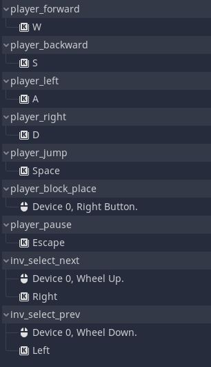

# Material Breeding Simulator 2020
Sam Kagan

### How to Play
Move around and place blocks according to the material you've selected.

#### The Materials
There are four materials that were going to be bred together:
* Wood: it's brown
* Gel: it's green
* Metal: it's brown with lots of splotches
* Stone: it's gray with lines

While they're no different except for their textures right now, they are treated
as if they are totally different.

#### Input Map

### Sources
* https://stackoverflow.com/questions/410227/test-if-object-implements-interface
* https://godotengine.org/qa/1595/lock-cursor-onscreen
* https://www.reddit.com/r/godot/comments/7h50gv/godot_3_ui_scale_and_dpi/
* https://godotengine.org/qa/50876/load-texture-from-file-and-assign-to-texture
* https://godotsharp.net/api/3.2.0/
* https://docs.microsoft.com/en-us/dotnet/
* https://docs.godotengine.org/en/stable/
* https://github.com/adam-p/markdown-here/wiki/Markdown-Cheatsheet#images
* https://www.reddit.com/r/godot/comments/9wqhd0/signals_with_arguments/
* https://godotengine.org/qa/22529/godot-3-how-to-texture-a-3d-model
* https://godotengine.org/qa/29100/how-to-modify-the-material-of-a-mesh-node-from-script
* https://www.gotut.net/godot-inheritance/
* https://www.reddit.com/r/godot/comments/fr0q86/scene_inheritance/
* https://godotengine.org/article/introducing-csharp-godot
* Movement and camera controller based on [this tutorial series](https://www.youtube.com/playlist?list=PLiUQR4U_J9efMalyhB1DtqywA_HPg-FrR)
* I downloaded [this demo](https://docs.godotengine.org/en/stable/_downloads/e4105f0d6448811bfc256845ba6dbaa3/gridmap_demo.zip) to better understand GridMap
* I looked at [this page](https://github.com/godotengine/godot/blob/9b3d43cb974dd3407fd0936e486e34b8cec436e7/scene/3d/physics_body_3d.cpp) of the source code
* Font obtained [from here](https://ftp.gnu.org/gnu/freefont/freefont-ttf.zip)
